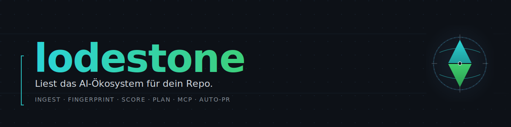

<p align="center">
  
</p>

<p align="center">
  <a href="https://github.com/jmt-labs/lodestone/actions/workflows/ci.yml"></a>
  <a href="LICENSE"></a>
  
  
</p>

`lodestone` sammelt AI-Ökosystem-Signale, scort sie deterministisch gegen
einen Repo-Fingerprint und liefert reproduzierbare Empfehlungen — als CLI,
als MCP-Server und als Claude-Skill-Pack.

Der Name ist Programm: Ein Lodestone ist ein natürlich magnetischer Stein —
ein Kompass, der zeigt, ohne den Kurs vorzuschreiben.

## Schnelleinstieg

```sh
go install github.com/jmt-labs/lodestone/cmd/lodestone@latest

cd dein-projekt/
lodestone init                # .lodestone.yaml + Skills + .gitignore-Snippet
lodestone fingerprint         # Repo analysieren
lodestone ingest              # 6 Quellen abrufen
lodestone score               # gegen Fingerprint scoren
lodestone signals --top 10    # Top-10 anzeigen
```

Detaillierte Anleitung im [**User-Guide**](docs/lodestone.md), volle
Subkommando-Übersicht in der [**CLI-Reference**](docs/cli-reference.md).

## Was lodestone liefert

- **Zwei Binaries:** `lodestone` (CLI) und `lodestone-mcp` (MCP-Server
  über stdio).
- **Sechs Ingest-Quellen** out of the box: GitHub-Trending, HackerNews,
  ArXiv, Anthropic-Changelog, OpenAI-Changelog, npm-Trending.
- **Deterministisches Scoring** (Compatibility / Effort / Risk) mit
  Determinismus-Garantie über Unit-Test und E2E-Diff.
- **Planning-Engine** ruft Claude über die `claude`-CLI und erzeugt
  Spec + Plan im superpowers-Format.
- **Auto-PR-Engine** (Phase 4) mit harten Safety-Gates: nur bei
  `risk=low ∧ effort=XS ∧ compatibility≥0.85`, max 1 PR/Tag, niemals
  auf `main`, immer Draft.
- **Vier Claude-Skills** (`lodestone-scout`, `-recommend`, `-plan`,
  `-review-trends`) — installierbar via `lodestone init`.

## Dokumentation

| Dokument | Inhalt |
|---|---|
| [User-Guide](docs/lodestone.md) | Installation, Konfig, jedes Subkommando mit Flags |
| [CLI-Reference](docs/cli-reference.md) | Vollständige Subkommando-Übersicht je Phase |
| [Architektur](docs/architecture.md) | Drei-Ebenen-Modell, Datenfluss, Code-Layout |
| [Release-Prozess](docs/release-process.md) | Tag-getriebener GoReleaser-Workflow |
| [Skills](flavors/lodestone/skills/) | Vier Claude-Skill-Markdowns |
| [Spec & Pläne](docs/superpowers/) | Design-Specs für Phase 1-4 |
| [Privacy-Spec](docs/superpowers/specs/2026-05-20-lodestone-sharing-privacy.md) | Cross-Repo-Sharing (Phase 5+) |
| [CHANGELOG](CHANGELOG.md) | Was sich pro Phase geändert hat |

## Lokale Artefakte

`lodestone` schreibt nach `.lodestone/` im Zielprojekt. Per Default
gehört dieses Verzeichnis in `.gitignore` — `lodestone init` legt den
Snippet automatisch an. Details: [User-Guide](docs/lodestone.md).

## Status

**Pre-Alpha.** Phasen 1–4 sind auf `main` gemerged und CI-grün; die
API-Stabilität ist noch nicht garantiert (`-alpha`-Suffix bis zur
ersten stabilen Release).

## Beiträge

Spec → Plan → Branch → TDD → PR. Siehe [CONTRIBUTING](CONTRIBUTING.md).
Pflicht-Skills, Sprachkonventionen und der direkte-`main`-Push-Bann sind
in [CLAUDE.md](CLAUDE.md) und [AGENTS.md](AGENTS.md) dokumentiert.

## Lizenz

[MIT](LICENSE) — Copyright (c) jmt-labs.
